# 🛡️ Null Point Framework

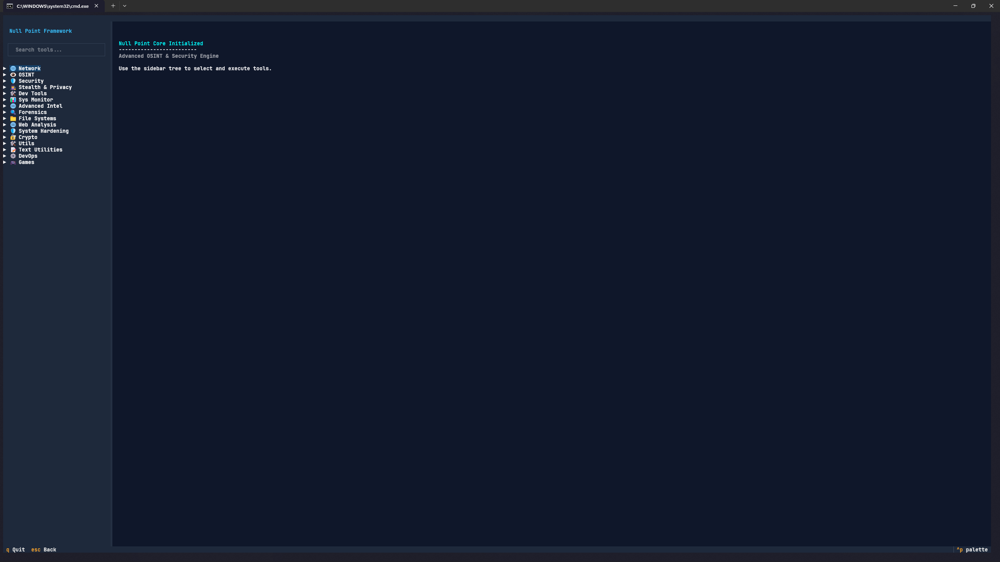

**Null Point Framework** is an advanced, centralized, and modern security and Open-Source Intelligence (OSINT) engine. Designed for educational purposes, it provides a comprehensive suite of tools for network assessment, intelligence gathering, and system auditing, all within a high-performance, terminal-based interface.

---

## ⚠️ Disclaimer

**This tool is strictly for educational purposes.** Use only on systems you own or have explicit, documented authorization to test. Unauthorized access, scanning, or testing of systems without permission is illegal. The developers are not responsible for any misuse of this software.

---

## 🚀 Features

The framework is organized into specialized categories for maximum efficiency and ease of use:

### 🌐 Network
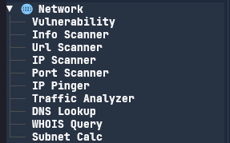
Comprehensive tools for network assessment, including vulnerability scanning, IP/Port scanning, and traffic analysis.

### 👁️ OSINT
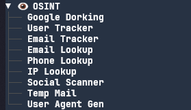
Powerful intelligence gathering utilities for social media, email, phone numbers, and web-based search queries.

### 🛡️ Security
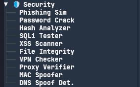
Core security testing tools for vulnerability scanning (SQLi, XSS), password cracking, and file integrity.

### 🕵️ Stealth & Privacy
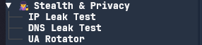
Essential tools for protecting your digital footprint, including IP/DNS leak tests and User-Agent rotation.

### 🛠️ Dev Tools

Handy utilities for developers, like JSON formatting, JWT decoding, and URL encoding/decoding.

### 📊 Sys Monitor
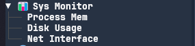
Real-time system monitoring for process memory, disk usage, and network interface statistics.

### 🌐 Advanced Intel

Deep intelligence gathering with certificate lookups and URL expansion tools.

### 🔍 Forensics
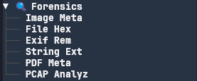
Digital forensics capabilities for analyzing image metadata, hex files, and PCAP files.

### 📁 File Systems
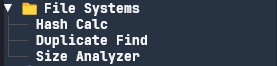
File management and analysis tools, including hash calculators and duplicate finders.

### 🌐 Web Analysis

Tools for inspecting web server configurations, including header checkers and robots.txt viewers.

### 🛡️ System Hardening
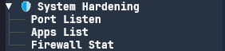
Tools to audit and improve system security, such as port listener and firewall status checks.

### 🔐 Crypto
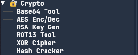
A suite of cryptographic utilities for encoding/decoding, key generation, and hash cracking.

### 🛠️ Utils
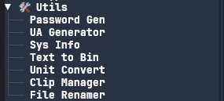
General-purpose utilities like password generators, system information, and file renamers.

### 📝 Text Utilities
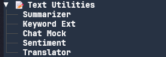
Specialized tools for processing text, including summarization and sentiment analysis.

### ⚙️ DevOps
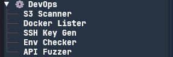
Tools for cloud and infrastructure management, including S3 scanners and Docker listers.

### 🎮 Games
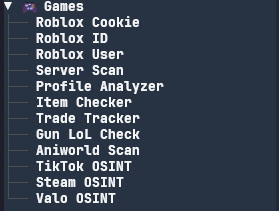
Niche OSINT tools for various gaming platforms like Roblox, Steam, and Valorant.

---

## 📋 Prerequisites

- **Python 3.10** or higher.
- **Windows Operating System** (for `start.bat` functionality).

## 🛠️ Installation

1. **Clone the Repository**
   ```bash
   git clone https://github.com/your-username/Null-Point
   cd Null-Point
   ```

2. **Install Dependencies**
   Run the provided setup script to install all required libraries:
   ```bash
   .\setup.bat
   ```

## 🚀 Usage

Run the main menu application using the provided batch script:

```bash
start.bat
```

The application will launch in your terminal. Use the sidebar to select tool categories and launch specific security or OSINT tools directly in the integrated terminal window.

## 🏗️ Development Standards

All tools have been refactored to modern standards:
* **Unified Theme**: Consistent CLI output using the built-in theme.
* **CLI Robustness**: All tools support CLI arguments via `argparse`, with interactive fallbacks.
* **Error Handling**: Comprehensive exception management for network and I/O operations.
* **TUI Integration**: The menu utilizes the `Textual` framework for a modern, responsive interface.
