# 🛡️ Null Point Framework

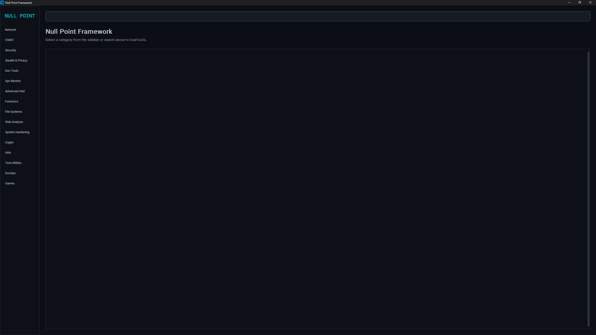

**Null Point Framework** is an advanced, centralized, and modern security and Open-Source Intelligence (OSINT) engine. Designed for educational purposes, it provides a comprehensive suite of tools for network assessment, intelligence gathering, and system auditing, all within a modern graphical interface.

---

## ⚠️ Disclaimer

**This tool is strictly for educational purposes.** Use only on systems you own or have explicit, documented authorization to test. Unauthorized access, scanning, or testing of systems without permission is illegal. The developers are not responsible for any misuse of this software.

---

## 🚀 Features

The framework is organized into specialized modules for maximum efficiency.

<div align="center">

| | | | |
| :---: | :---: | :---: | :---: |
| 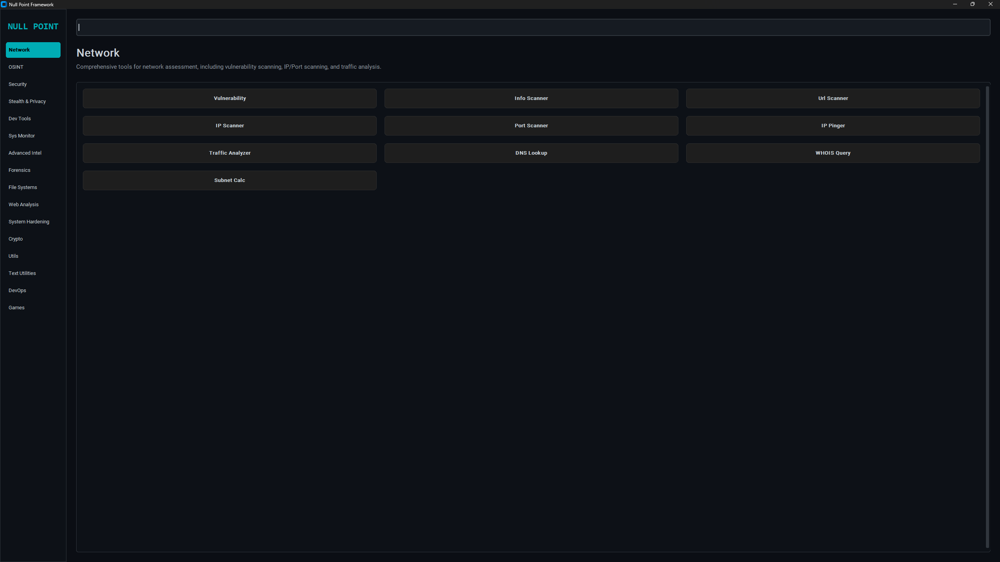<br>**Network** | 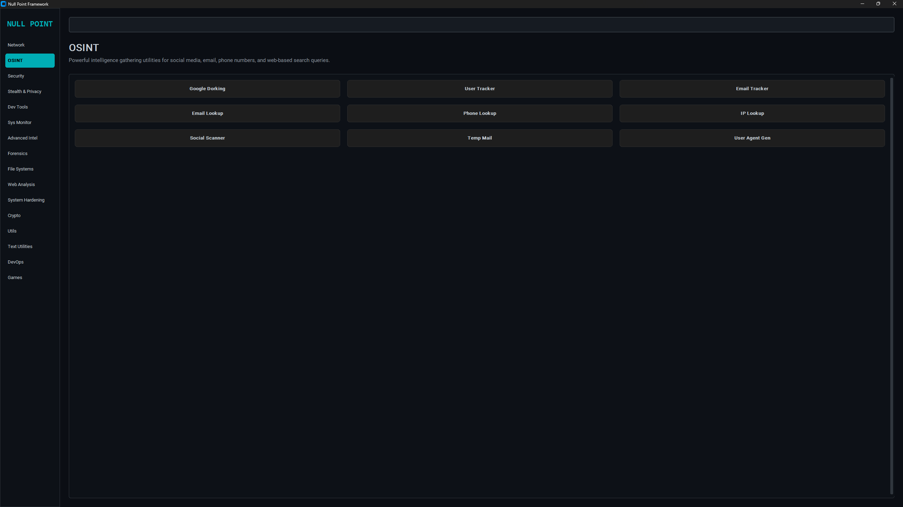<br>**OSINT** | 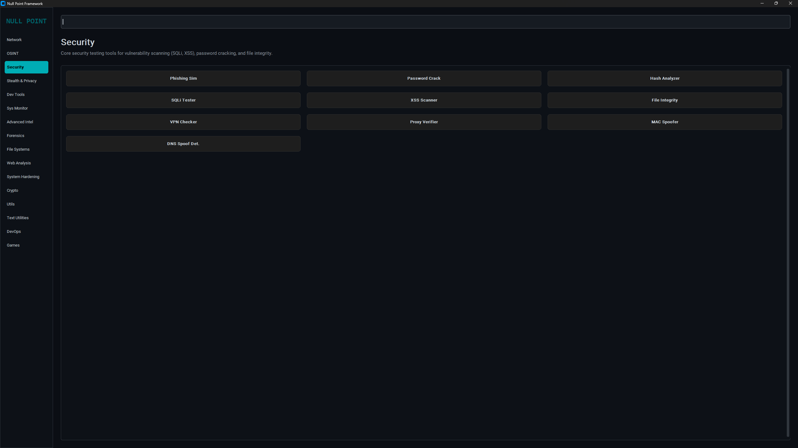<br>**Security** | 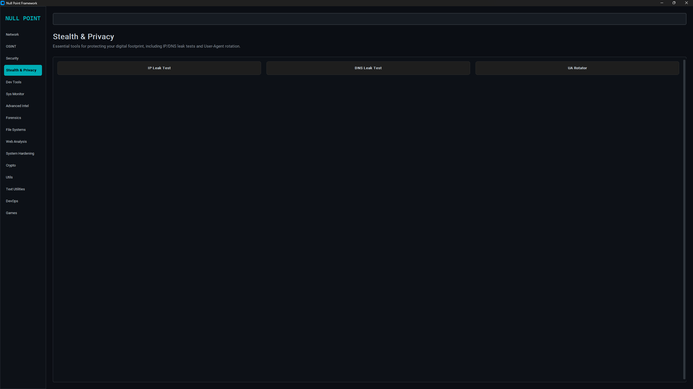<br>**Stealth & Privacy** |
| 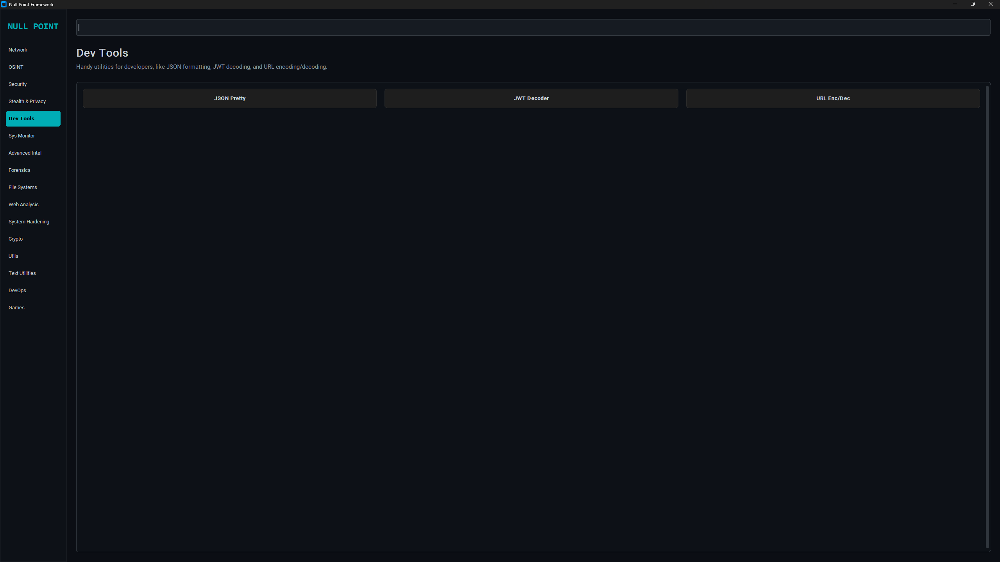<br>**Dev Tools** | 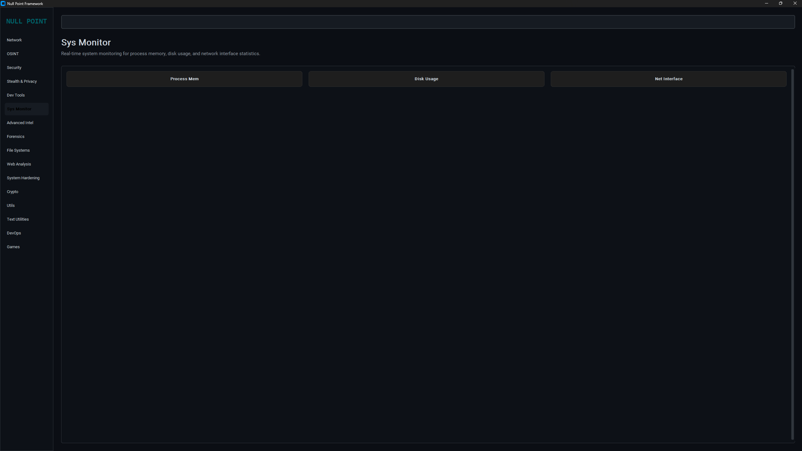<br>**Sys Monitor** | 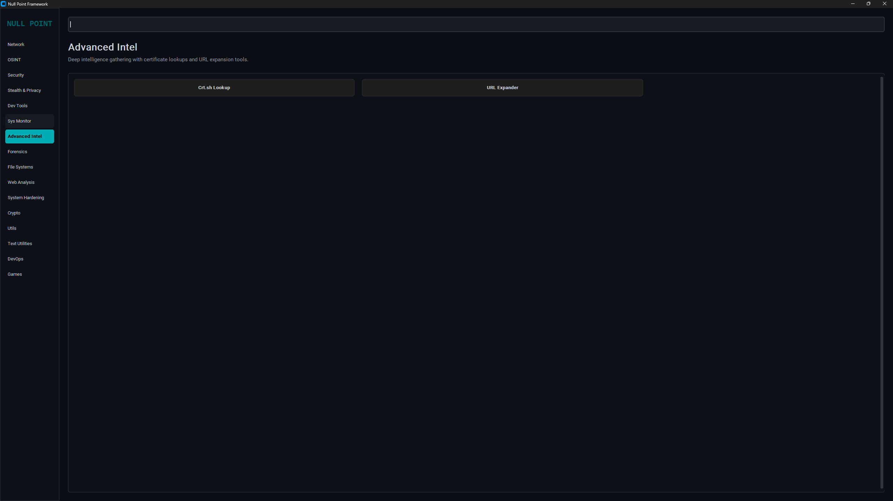<br>**Advanced Intel** | 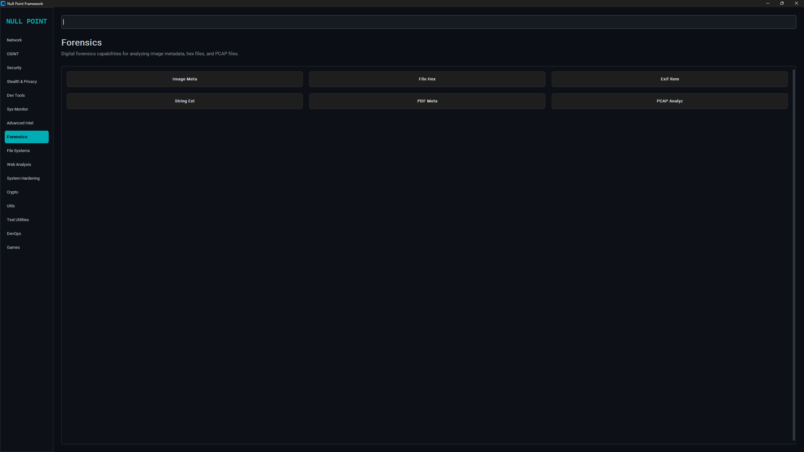<br>**Forensics** |
| 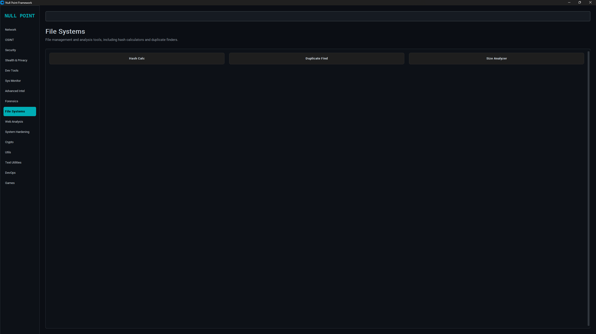<br>**File Systems** | 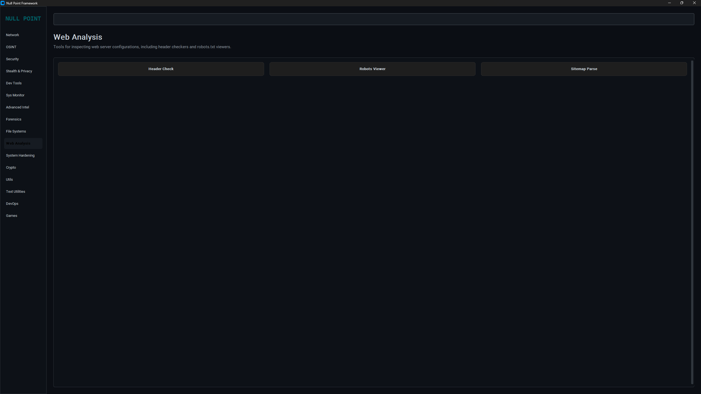<br>**Web Analysis** | 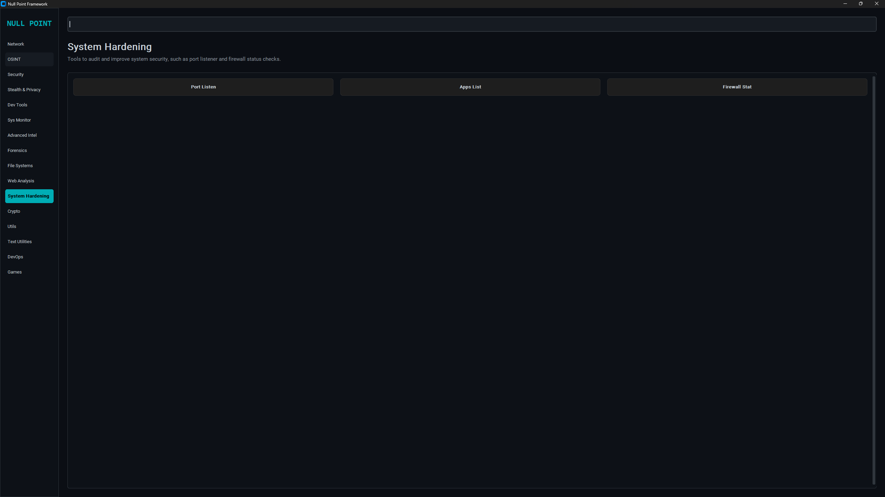<br>**System Hardening** | 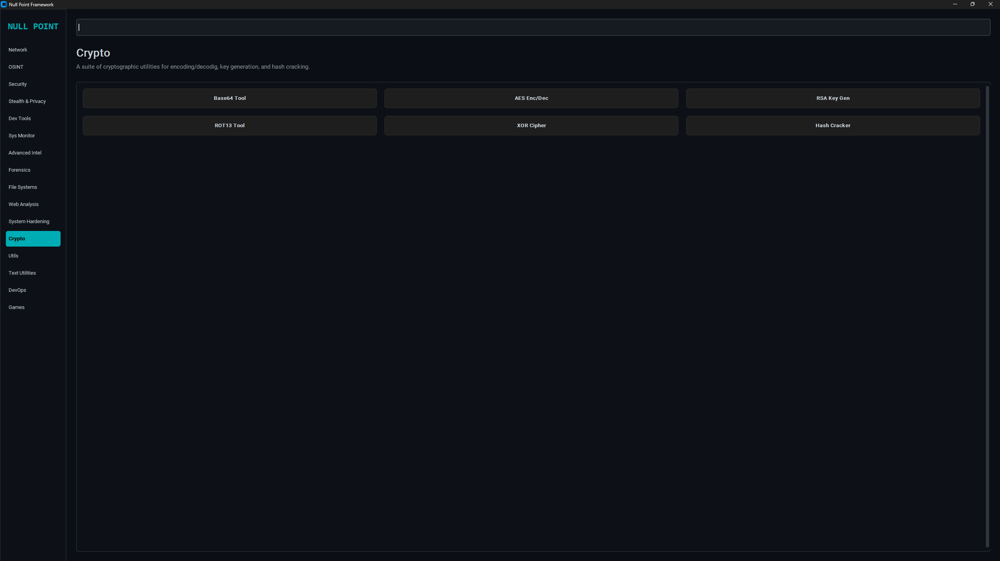<br>**Crypto** |
| 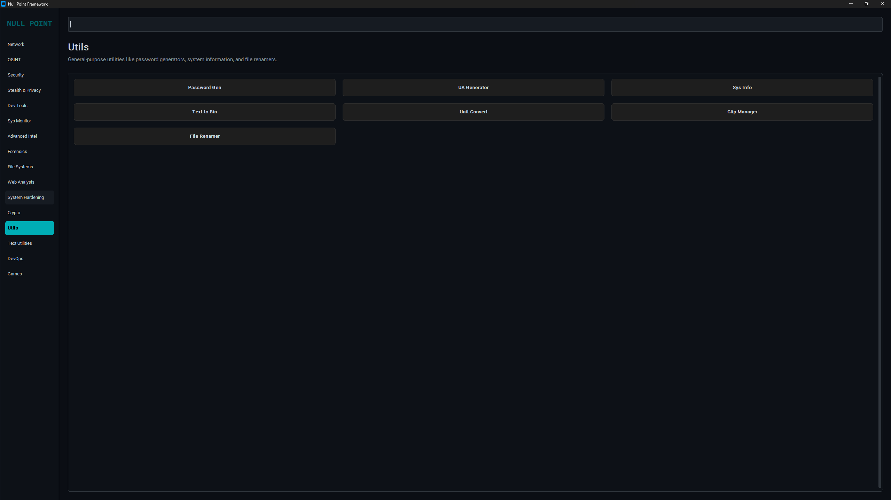<br>**Utils** | 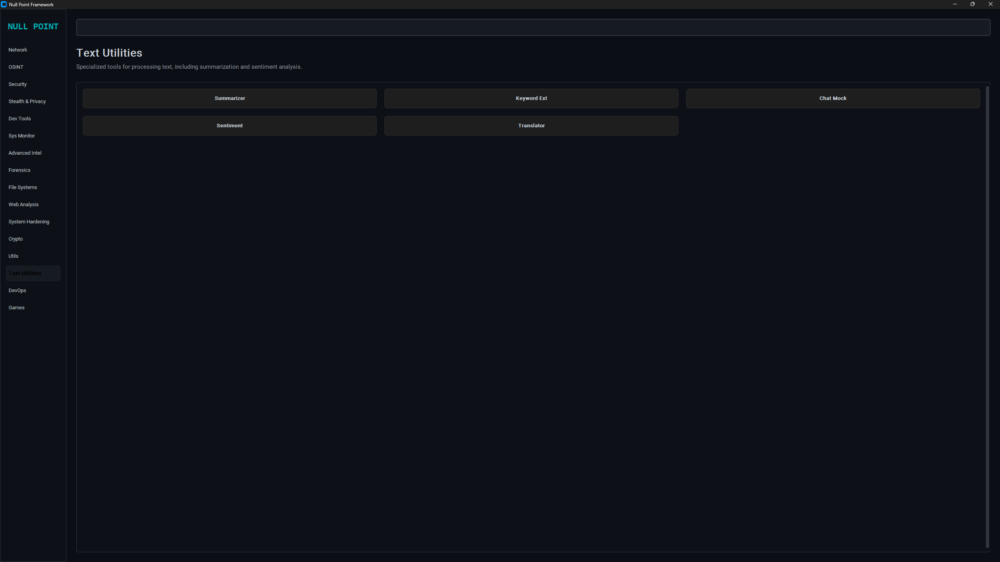<br>**Text Utilities** | 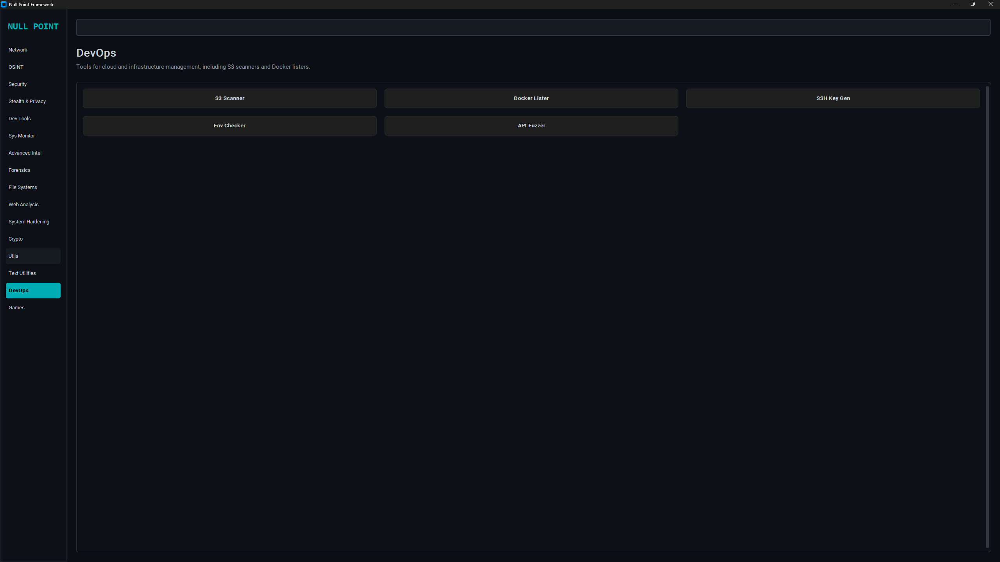<br>**DevOps** | 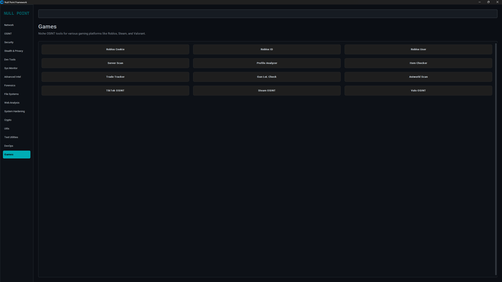<br>**Games** |

</div>

### 🔍 Module Breakdown

#### 🌐 Network
Comprehensive tools for network assessment, including vulnerability scanning, IP/Port scanning, and traffic analysis.

#### 👁️ OSINT
Powerful intelligence gathering utilities for social media, email, phone numbers, and web-based search queries.

#### 🛡️ Security
Core security testing tools for vulnerability scanning (SQLi, XSS), password cracking, and file integrity.

#### 🕵️ Stealth & Privacy
Essential tools for protecting your digital footprint, including IP/DNS leak tests and User-Agent rotation.

#### 🛠️ Dev Tools
Handy utilities for developers, like JSON formatting, JWT decoding, and URL encoding/decoding.

#### 📊 Sys Monitor
Real-time system monitoring for process memory, disk usage, and network interface statistics.

#### 🌐 Advanced Intel
Deep intelligence gathering with certificate lookups and URL expansion tools.

#### 🔍 Forensics
Digital forensics capabilities for analyzing image metadata, hex files, and PCAP files.

#### 📁 File Systems
File management and analysis tools, including hash calculators and duplicate finders.

#### 🌐 Web Analysis
Tools for inspecting web server configurations, including header checkers and robots.txt viewers.

#### 🛡️ System Hardening
Tools to audit and improve system security, such as port listener and firewall status checks.

#### 🔐 Crypto
A suite of cryptographic utilities for encoding/dec decoding, key generation, and hash cracking.

#### 🛠️ Utils
General-purpose utilities like password generators, system information, and file renamers.

#### 📝 Text Utilities
Specialized tools for processing text, including summarization and sentiment analysis.

#### ⚙️ DevOps
Tools for cloud and infrastructure management, including S3 scanners and Docker listers.

#### 🎮 Games
Niche OSINT tools for various gaming platforms like Roblox, Steam, and Valorant.

---

## ⛓️ Tool Chaining

One of the most powerful features of Null Point is **Tool Chaining**. You can pipe the output of one tool directly into the input of another using the `/chain` command in the search bar.

**Example:**
1. Run an `IP Scanner` on a network.
2. Copy the target IP.
3. In the search bar, type `/chain [next_tool_name]`.
4. The IP will be automatically passed as the input to the next tool.

---

## 📋 Prerequisites

- **Python 3.10** or higher.

## 🛠️ Installation

1. **Clone the Repository**
   ```bash
   git clone https://github.com/JP-devs/null_point.git
   cd null_point
   ```

2. **Install Dependencies**
   ```bash
   pip install -r requirements.txt
   ```

## 🚀 Usage

Launch the framework using the GUI:

```bash
python null_point_gui.py
```

## 🏗️ Development Standards

* **Unified Theme**: Consistent CLI output using the built-in theme.
* **CLI Robustness**: All tools support CLI arguments via `argparse`, with interactive fallbacks.
* **Error Handling**: Comprehensive exception management for network and I/O operations.
* **Tool Chaining**: Native support for chaining tools.
* **Automated Testing**: A comprehensive test suite is located in `tests/`.

## 🐳 Containerization & CI/CD

* **Docker Support**: A `Dockerfile` is provided for easy deployment.
* **Continuous Integration**: GitHub Actions are configured to run tests on every push.

## 🗺️ Future Roadmap

* **Enhanced GUI**: Integrating more complex interactive widgets and real-time data visualizations.
* **Expanded Toolset**: Continuous addition of new security and OSINT modules.
* **Plugin System**: Developing a modular plugin architecture.
